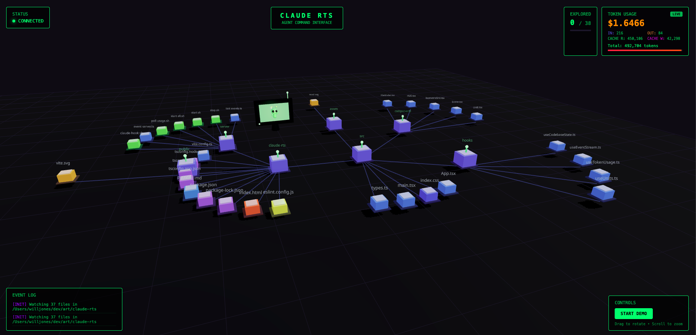

# Claude RTS (Real-Time Strategy Visualizer)

A Tauri desktop application that visualizes Claude Code activity in real-time. Watch your codebase exploration and file operations come to life in an isometric RTS-style 3D interface with embedded terminal support.



## Features

- **Real-time 3D visualization**: See file reads, writes, edits, and searches as animated units moving across an isometric grid
- **Codebase mapping**: Automatically scans and maps your project structure using a radial tree layout
- **Token usage tracking**: Monitor Claude Code API usage and costs in real-time with budget alerts
- **Embedded terminal**: Full PTY terminal integration with multi-tab support
- **File viewer**: Click on files in the visualization to view their contents with syntax highlighting
- **Directory navigation**: Breadcrumb navigation and collapsible directories for large codebases
- **Demo mode**: Test the visualization with simulated events

## Tech Stack

### Frontend
- **React 19** with TypeScript
- **React Three Fiber** + **Three.js** for 3D rendering
- **xterm.js** for terminal emulation
- **Zustand** for state management
- **Vite** for development and building

### Backend (Tauri)
- **Tauri 2** for the desktop application framework
- **Rust** with portable-pty for cross-platform terminal support
- **tokio** for async runtime

### Event Server
- **Node.js** with WebSocket for real-time event streaming
- Bash scripts for Claude Code hook integration

## Prerequisites

- **Node.js** v18 or higher
- **Rust** (for Tauri development)
- **npm** or **pnpm**
- **jq** (for usage polling)
  - macOS: `brew install jq`
  - Linux: `sudo apt-get install jq`

## Installation

1. **Clone the repository**:
   ```bash
   git clone <repository-url>
   cd claude-rts
   ```

2. **Install dependencies**:
   ```bash
   npm install
   ```

3. **Make server scripts executable**:
   ```bash
   chmod +x server/*.sh
   ```

## Running the Application

### Tauri Desktop App (Recommended)

Run the full desktop application with embedded terminal:

```bash
npm run tauri:dev
```

This starts the Tauri app with hot-reload enabled.

### Web Development Mode

For frontend-only development:

```bash
npm run start:all
```

This starts:
- Event server on port 8765 (WebSocket) and 8766 (HTTP)
- Usage poller for Claude Code stats
- Vite dev server on port 5173

### Services Separately

```bash
npm run server    # Event server only
npm run dev       # Frontend only
npm start         # Server + frontend
```

## Building for Production

### Desktop App

```bash
npm run tauri:build
```

Outputs platform-specific installers:
- macOS: `.dmg`
- Windows: `.exe`
- Linux: `.AppImage`

### Web Build

```bash
npm run build
```

Built files output to `dist/`.

## Claude Code Integration

To receive real-time events from Claude Code:

1. **Configure the hook** in Claude Code settings to point to `server/claude-hook.sh`

2. **The hook captures**:
   - File operations (Read, Write, Edit)
   - Directory listings and searches
   - Command executions
   - Task events

3. Events are sent to `http://localhost:8766/event` and broadcast via WebSocket

## Project Structure

```
claude-rts/
├── src/                          # React frontend
│   ├── App.tsx                   # Main app orchestration
│   ├── components/
│   │   ├── Scene.tsx             # Three.js canvas setup
│   │   ├── IsometricGrid.tsx     # Grid rendering and file buildings
│   │   ├── Unit.tsx              # Animated agent units
│   │   ├── HUD.tsx               # Heads-up display and event log
│   │   ├── FileModal.tsx         # File viewer with syntax highlighting
│   │   ├── Terminal.tsx          # xterm.js terminal component
│   │   ├── TerminalTabs.tsx      # Multi-terminal tab management
│   │   └── ContextMenu.tsx       # Right-click context menu
│   ├── hooks/
│   │   ├── useCodebaseState.ts   # File tree and grid management
│   │   ├── useEventStream.ts     # WebSocket event handling
│   │   ├── useUnits.ts           # Unit spawning and movement
│   │   └── useTokenUsage.ts      # Token tracking and cost alerts
│   └── stores/
│       └── terminalStore.ts      # Zustand terminal state
├── src-tauri/                    # Tauri Rust backend
│   ├── src/
│   │   ├── lib.rs                # PTY, file scanning, stats reading
│   │   └── main.rs               # Entry point
│   ├── Cargo.toml                # Rust dependencies
│   └── tauri.conf.json           # Tauri configuration
├── server/                        # Node.js event server
│   ├── event-server.ts           # WebSocket + HTTP server
│   ├── claude-hook.sh            # Claude Code hook script
│   ├── poll-usage.sh             # Usage stats poller
│   ├── start-all.sh              # Start all services
│   └── stop.sh                   # Stop all services
└── package.json
```

## Available Scripts

| Command | Description |
|---------|-------------|
| `npm run dev` | Start Vite dev server |
| `npm run build` | Build for production |
| `npm run tauri:dev` | Run Tauri desktop app (dev mode) |
| `npm run tauri:build` | Build Tauri desktop app |
| `npm run server` | Start event server only |
| `npm start` | Start server + frontend |
| `npm run start:all` | Start all services |
| `npm run lint` | Run ESLint |

## Ports Used

- **8765**: WebSocket server for real-time events
- **8766**: HTTP server for events and file serving
- **5173**: Vite dev server (web mode)

## Troubleshooting

### Port Already in Use

```bash
./server/stop.sh
```

### WebSocket Connection Issues

```bash
curl http://localhost:8766/health
```

Check browser console for connection errors.

### Terminal Not Working (Tauri)

Ensure Rust and Tauri CLI are properly installed:
```bash
cargo --version
npm run tauri info
```

### File Structure Not Loading

- Event server scans the current working directory by default
- Pass a custom path: `npx tsx server/event-server.ts /path/to/project`

## License

MIT
